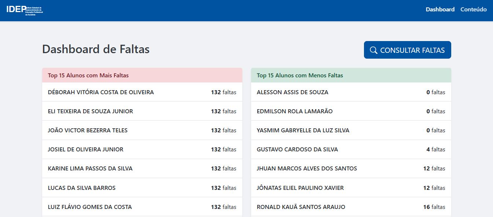

# Portal Acadêmico IDEP - Dashboard de Faltas e Conteúdo do Curso

Este projeto consiste em um portal web interativo desenvolvido para o Instituto Estadual de Desenvolvimento da Educação Profissional de Rondônia (IDEP). Ele permite a visualização e consulta de informações acadêmicas, com foco no controle de faltas de alunos e no acompanhamento de informações relevantes sobre o curso.

## Visão Geral

O portal é uma Single Page Application (SPA) que busca dados de uma planilha Google Sheets pública e os apresenta de forma organizada e interativa. As principais seções são o "Dashboard de Faltas" e a página de "Conteúdo" do curso.

## Funcionalidades Principais

*   **Fonte de Dados Dinâmica:** Os dados dos alunos e suas faltas são carregados em tempo real a partir de uma planilha Google Sheets configurada para acesso público via CSV.
*   **Dashboard de Faltas:**
    *   Apresenta rankings dos alunos com mais e menos faltas.
    *   O total de faltas é obtido da coluna BH da planilha.
    *   Unifica registros de alunos com o mesmo nome, somando suas faltas (da coluna BH).
    *   Filtra entradas irrelevantes como "Professor(a)" ou linhas de formatação.
*   **Consulta Detalhada de Faltas (Modal Interativo):**
    *   Permite pesquisar por alunos pelo nome (com atualização dinâmica e busca por "Enter").
    *   Exibe o total de faltas do aluno pesquisado e o limite de faltas permitido (41).
    *   Ao clicar em um aluno, um segundo modal exibe todas as datas específicas em que o aluno faltou (obtidas das colunas C a BF da planilha).
*   **Seção "Conteúdo":**
    *   Mostra uma contagem regressiva para a data de término do curso (22 de Maio de 2025).
*   **Interface Responsiva e Temática:**
    *   Layout responsivo construído com Bootstrap 5.
    *   Esquema de cores e logo (SVG) seguindo a identidade visual do IDEP.
    *   Navegação fluida entre seções sem recarregamento da página.
    *   Rodapé informativo.

## Tecnologias Utilizadas

*   **HTML5:** Estruturação do conteúdo web.
*   **CSS3:** Estilização visual, incluindo:
    *   CSS customizado para o tema IDEP.
    *   Framework [Bootstrap 5.3](https://getbootstrap.com/) para layout responsivo e componentes.
    *   [Bootstrap Icons](https://icons.getbootstrap.com/) para iconografia.
*   **JavaScript (ES6+):** Lógica do lado do cliente para:
    *   Busca assíncrona (`fetch`) e processamento de dados CSV.
    *   Manipulação dinâmica do Document Object Model (DOM).
    *   Interatividade dos modais e da pesquisa.
    *   Navegação no estilo SPA (Single Page Application).
    *   Cálculo e exibição da contagem regressiva.

## Estrutura do Projeto

O projeto é contido em um único arquivo principal:

*   `Index.html`: Contém todo o HTML, CSS (inline e via `<style>`) e JavaScript necessários para o funcionamento do portal.

## Como Executar Localmente

1.  Clone ou baixe o arquivo `Index.html`.
2.  Como o site busca dados de uma URL externa (`docs.google.com`), ele precisa ser servido por um servidor web local para evitar problemas de CORS (Cross-Origin Resource Sharing). Simplesmente abrir o `Index.html` diretamente no navegador (`file:///`) provavelmente não permitirá que os dados sejam carregados.
3.  **Usando Python:**
    *   Navegue pelo terminal até o diretório onde o `Index.html` está localizado.
    *   Execute `python -m http.server` (para Python 3) ou `python -m SimpleHTTPServer` (para Python 2).
    *   Abra seu navegador e acesse `http://localhost:8000` (ou a porta indicada pelo servidor).
4.  **Usando Node.js (com http-server):**
    *   Navegue pelo terminal até o diretório.
    *   Se não tiver, instale globalmente: `npm install -g http-server`.
    *   Execute: `http-server`.
    *   Abra seu navegador e acesse `http://localhost:8080` (ou a porta indicada).
5.  **Usando Extensões de Editor (Ex: Live Server no VS Code):**
    *   Clique com o botão direito no arquivo `Index.html` e escolha "Open with Live Server" (ou similar).

## Fonte dos Dados

A fonte de dados para as faltas dos alunos é uma planilha Google Sheets. A URL pública para o CSV utilizado no código é:
`https://docs.google.com/spreadsheets/d/e/2PACX-1vRbBQgS81J9772JRSjMwnbyyU7FyaSQXUjAG1arGBu4XSQ6uxGYGcurctOmJTLqIaRmyF86M4Xf7NtI/pub?output=csv`

Certifique-se de que esta planilha está configurada corretamente para publicação na web e que a estrutura das colunas (B para nome, BH para total de faltas, C-BF para dias de aula com "F" para faltas, e linha 4 para cabeçalhos de data) seja mantida para o correto funcionamento do portal.
